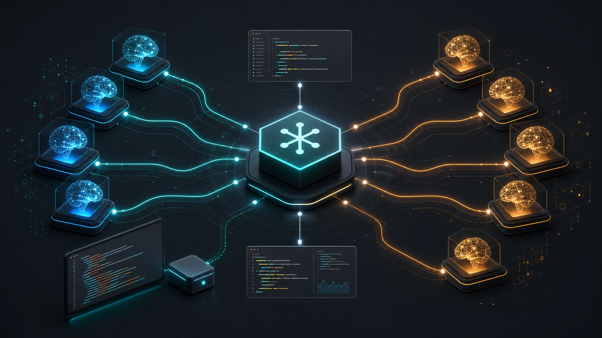

# AgentSpawnMCP

<p align="center">
  
</p>

Universal MCP server for any OpenAI-compatible LLM. Supports OpenAI and Anthropic API formats, cloud providers (OpenAI, Grok, Claude, Minimax, DeepSeek) and local models (Ollama, LM Studio, Jan). Built on FastMCP with pure httpx.

## Quick Start — Spawn Agents

```bash
# No install needed — run directly with uvx
export MINIMAX_TOKEN=your-token
uvx agent-spawn-mcp spawn \
  --name minimax \
  --url https://api.minimax.io/anthropic/v1 \
  --token-env MINIMAX_TOKEN \
  --model MiniMax-M2.7 \
  --api-type anthropic
```

Or install globally:

```bash
pip install agent-spawn-mcp
agent-spawn-mcp spawn --name minimax --url https://api.minimax.io --token-env MINIMAX_TOKEN --model MiniMax-M2.7
```

## API Types

- `--api-type openai` (default) — OpenAI-compatible (`chat/completions`)
- `--api-type anthropic` — Anthropic API (`v1/messages`)

### URL versioning

Pass `--url` pointing directly at the API root. If your base URL already contains
a version segment (e.g. `…/paas/v4`), the client will **not** re-append `v1/`.
Examples:

| Provider       | `--url`                                      | `--api-type` |
|----------------|----------------------------------------------|--------------|
| OpenAI         | `https://api.openai.com/v1`                  | openai       |
| Grok           | `https://api.x.ai/v1`                        | openai       |
| z.ai (primary) | `https://api.z.ai/api/paas/v4`               | openai       |
| z.ai (coding)  | `https://api.z.ai/api/coding/paas/v4`        | openai       |
| z.ai Anthropic | `https://api.z.ai/api/anthropic`             | anthropic    |
| Anthropic      | `https://api.anthropic.com`                  | anthropic    |
| Minimax        | `https://api.minimax.io/anthropic/v1`        | anthropic    |

## Claude Code / OpenCode Integration

Add to your `.mcp.json`:

```json
{
  "mcpServers": {
    "minimax-agent": {
      "command": "uvx",
      "args": ["agent-spawn-mcp", "spawn",
               "--name", "minimax",
               "--url", "https://api.minimax.io/anthropic/v1",
               "--token", "your-minimax-token",
               "--model", "MiniMax-M2.7",
               "--api-type", "anthropic"]
    },
    "claude-agent": {
      "command": "uvx",
      "args": ["agent-spawn-mcp", "spawn",
               "--name", "claude",
               "--url", "https://api.anthropic.com",
               "--token", "your-anthropic-token",
               "--model", "claude-sonnet-4-20250514",
               "--api-type", "anthropic"]
    },
    "glm-agent": {
      "command": "uvx",
      "args": ["agent-spawn-mcp", "spawn",
               "--name", "glm",
               "--url", "https://api.z.ai/api/paas/v4",
               "--token", "your-zai-token",
               "--model", "glm-5.1"]
    },
    "glm-turbo-agent": {
      "command": "uvx",
      "args": ["agent-spawn-mcp", "spawn",
               "--name", "glm-turbo",
               "--url", "https://api.z.ai/api/paas/v4",
               "--token", "your-zai-token",
               "--model", "glm-5-turbo"]
    }
  }
}
```

**Gotchas:**
- Each entry in `.mcp.json` must use a unique `--name` — it becomes the tool
  name `{name}_agent`, and duplicates collide.
- `--token` on the command line is visible in `ps` output and some crash logs.
  Prefer keeping the MCP config file read-protected (`chmod 600`).

## Codex CLI Integration

Codex can register stdio MCP servers with `codex mcp add`.

For a Minimax Anthropic-compatible agent:

```bash
export MINIMAX_TOKEN=your-minimax-token

codex mcp add minimax-agent -- \
  uvx agent-spawn-mcp spawn \
    --name minimax \
    --url https://api.minimax.io/anthropic/v1 \
    --token-env MINIMAX_TOKEN \
    --model MiniMax-M2.7 \
    --api-type anthropic
```

For z.ai GLM through the OpenAI-compatible API:

```bash
export ZAI_TOKEN=your-zai-token

codex mcp add glm-agent -- \
  uvx agent-spawn-mcp spawn \
    --name glm \
    --url https://api.z.ai/api/paas/v4 \
    --token-env ZAI_TOKEN \
    --model glm-5.1
```

Verify the registration:

```bash
codex mcp list
codex mcp get minimax-agent
```

Restart Codex from a shell where the token env var is set. The tool exposed to
Codex is named from `--name`, for example `minimax_agent` or `glm_agent`.

If you need Codex to store the env var with the MCP server config, add
`--env MINIMAX_TOKEN="$MINIMAX_TOKEN"` before `--`. This is convenient, but it
stores the secret in Codex config. Passing `--token` directly also works, but
stores the token in the command args.

## Tools Exposed

- `{name}_agent(task, model?, system_prompt?, temperature?, max_tokens?, timeout?)` — Spawn agent
- `agent_info()` — Get provider info

### `max_tokens` behaviour

The client imposes **no cap**. Behaviour when `max_tokens` is omitted depends
on `--api-type`:

- **`openai`** — the field is simply not sent; the provider falls back to its
  own default (usually the model's full output budget). Reasoning models like
  GLM-5.x can burn huge amounts on chain-of-thought, so pass an explicit
  limit for short tasks.

- **`anthropic`** — the Anthropic API requires the field, so when you omit
  it the client fills in a safe default of **16384**. Override when you
  need more or want to cap spend:

  ```python
  claude_agent(task="summarise this PR")                    # uses 16384
  claude_agent(task="exhaustive review", max_tokens=64000)  # bigger
  claude_agent(task="ping",              max_tokens=256)    # cheaper
  ```

  Typical values:

  | Use case                    | `max_tokens` |
  |-----------------------------|--------------|
  | Short answer / ping         | 1024         |
  | Summary / routine agent run | 4096         |
  | Code generation / long task | 8192         |
  | Default (if omitted)        | **16384**    |
  | Exhaustive analysis         | 32000+       |

  Upper bound is model-specific (Claude Sonnet 4 — 64k, Opus 4 — 32k,
  GLM-4.5-Air — 8k, etc.). Pass `max_tokens` explicitly up to that limit.

## Return Format

```python
{
    "result": "...",  # Agent response text
    "metadata": {
        "provider": "minimax",
        "model_used": "MiniMax-M2.7",
        "usage": {"prompt_tokens": 100, "completion_tokens": 500},
        "latency_ms": 2340
    }
}
```

---

## AgentSpawnMCP — Full Server

Full MCP server with all tools (chat, vision, files, search, agent). Requires git clone.

```bash
git clone https://github.com/sandsaber/AgentSpawnMCP
cd AgentSpawnMCP
uv sync
cp example.env .env
# Edit .env with your tokens

uv run python main.py main --provider grok
```

### Auto-Discovery

Providers auto-detected when env var is set:

| Env Var | Provider |
|---------|----------|
| `XAI_TOKEN` | Grok |
| `OPENAI_TOKEN` | OpenAI |
| `GROQ_TOKEN` | Groq |
| `DEEPSEEK_TOKEN` | DeepSeek |
| `ZAI_TOKEN` | z.ai (GLM) |

### Available Tools (Full Server)

| Tool | Description |
|------|-------------|
| `list_providers` | All discovered providers |
| `list_models` | Models for the active provider |
| `chat` | Text completion with session history |
| `stateful_chat` | Server-side conversation |
| `chat_with_vision` | Analyze images (jpg/jpeg/png) |
| `generate_image` | Create or edit images (OpenAI-format only) |
| `upload_file` / `list_files` / `get_file_content` / `delete_file` | File management |
| `chat_with_files` | Chat with documents |
| `web_search` | Agentic web search |
| `code_executor` | Execute code |
| `agent` | Unified agent |
| `list_chat_sessions` / `get_chat_history` / `clear_chat_history` | Session history |

---

## Image generation support

`generate_image` targets the OpenAI `/images/generations` request shape
(`model` / `prompt` / `n` / `image_url`). Providers that expose the same
shape (OpenAI `dall-e-3`, Grok `grok-imagine-image`) work out of the box.

Providers with custom image APIs are **not** currently supported:
- z.ai (`glm-image`, `cogview-4-250304`) expects `quality` / `size` / `user_id`
  at `/paas/v4/images/generations`, not the OpenAI shape.
- Anthropic-compat endpoints don't expose image generation at all.

For these, use the provider's native HTTP API directly.

## License

MIT License. Copyright (c) 2026 Michael Makarov.

See [LICENSE](LICENSE) for the full license text.
